# 🌌 Albert: A Multi-Physics Differential PyTorch Research Engine

<div align="center">
  
  
  **Unified Physics at The Speed of AI**
  
  [](https://github.com/pimdewitte/albert)
  [](https://discord.gg/xdybbSk5)
  []()
  
  *A PyTorch-based multi-physics engine for testing and validating theories across all fields of physics through differentiable simulations.*
</div>

---

## 🚀 Quick Start

```bash
# One-line installation
curl -fsSL https://raw.githubusercontent.com/PimDeWitte/albert/refs/heads/main/download_cli.sh | bash

# Clone and setup
git clone https://github.com/pimdewitte/albert.git
cd albert
./setup_unified.sh

# Run all theories (standard run)
albert run

# Run theories by physics field
albert run --physics-fields gravitational         # Only gravitational theories
albert run --physics-fields thermodynamic fluid_dynamics  # Multiple fields
albert run --physics-fields particle_physics      # Particle physics only

# Run with specific options
albert run --max-steps 100000
albert run --theories schwarzschild kerr
albert run --theories schwarzschild --black-hole-preset stellar_mass
albert run --category quantum

# Test a single theory from file
albert run --single-theory path/to/my_theory.py

# Configure Albert (API keys, etc.)
albert setup

# Discover new theories automatically
albert discover --initial "unified field theory"

# Discover variations of an existing theory
albert discover --from-theory theories/quantum_corrected

# Optional: Make albert available globally
sudo ln -s $(pwd)/albert /usr/local/bin/albert
# Now you can use 'albert' from anywhere
```

---

## 🧬 Bridging Fundamental Physics and Machine Learning

Albert enables a new paradigm: learning from verifiable physics simulations to create high-quality training data. By implementing theories as computational models—metric tensors and field equations—our solvers generate trajectories that are guaranteed to follow the laws of physics. This creates a unique opportunity to train AI systems on data that is both physically correct and computationally verified, bridging the gap between theoretical physics and machine learning through differentiable simulations in PyTorch.

The framework's differentiable nature means every simulation becomes a potential training example, where gradient-based optimization can learn from the physics itself. This approach transforms how we create datasets for physics AI—instead of relying on limited experimental data, we can generate unlimited training examples from theories that have been validated against observations.

## 🌟 Multi-Physics Framework

Albert now supports theories across multiple fields of physics, not just gravity:

### Supported Physics Fields

- **Gravitational Physics** - General relativity, modified gravity, quantum gravity
- **Thermodynamics** - Black hole thermodynamics, emergent spacetime from entanglement
- **Fluid Dynamics** - Relativistic fluids, analog gravity in superfluids
- **Electromagnetism** - Charged black holes, plasma physics in curved spacetime
- **Particle Physics** - Quantum field theory, anomalies, high-energy phenomena
- **Cosmology** - Dark energy, inflation, CMB physics

Each field has specialized validators and theories that test field-specific phenomena while maintaining connections to other fields through unified physics principles.

---

## 🎯 Command Line Interface

Albert provides a unified CLI with multiple subcommands:

### `albert run` - Run Theory Simulations
```bash
# Run all theories with default settings
albert run

# Run theories by physics field
albert run --physics-fields gravitational       # Gravitational theories only
albert run --physics-fields thermodynamic       # Thermodynamic theories only
albert run --physics-fields particle_physics cosmology  # Multiple fields

# Run specific theories
albert run --theories schwarzschild kerr        # Multiple theories
albert run --category quantum                    # Run category
albert run --candidates                          # Include candidates
albert run --single-theory path/to/theory.py    # Test a single theory file

# Black hole configurations
albert run --black-hole-preset stellar_mass      # 10 solar masses
albert run --black-hole-preset primordial_mini   # Default: quantum scale
albert run --black-hole-preset sagittarius_a_star # Galactic center
albert run --black-hole-preset laboratory_micro  # Extreme quantum regime
albert run --black-hole-preset intermediate_mass # Globular clusters

# Particle simulations
albert run --particles electron photon neutrino  # Multi-particle
albert run --particles proton                    # Specific particle

# Performance options
albert run --device cuda --dtype float32         # GPU acceleration
albert run --device cpu --dtype float64          # Max precision
albert run --max-steps 1000000                   # Million-step trajectories
albert run --no-cache                            # Force recomputation
albert run --clear-cache                         # Clear cache and exit

# Advanced options
albert run --validators-only                     # Skip trajectory computation
albert run --max-parallel-workers 16             # Parallel processing
albert run --test                                # Run pre-flight tests
albert run --enable-sweeps                       # Enable parameter sweeps
albert run --sweep-only gamma                    # Sweep only specific parameter
albert run --experimental                        # Enable experimental quantum features
albert run --verbose                             # Enable verbose logging
albert run --final                               # High-quality publication mode
albert run --early-stop                          # Enable early stopping
albert run --quantum-field-content all           # Configure quantum field content
```

### `albert discover` - AI Theory Discovery
```bash
# Start discovery with default settings
albert discover

# Discovery with initial prompt
albert discover --initial "unified field theory with torsion"

# Improve existing theory
albert discover --from-theory theories/quantum_corrected

# Continuous monitoring mode
albert discover --self-monitor

# Token-space restrictions (reduce search with LLM proposals)
albert discover --operands t,r,theta,phi,M,rs,q_gen --unary SIN,COS,DT --binary ADD,MUL,POW

# Adaptive stopping instead of fixed candidate count
albert discover --time-budget-seconds 120              # stop after 2 minutes
albert discover --target-unique 100                    # stop after 100 unique expressions
albert discover --patience 5 --batch-size 10           # stop if 5 batches add no new unique

# Fixed-size run (legacy)
albert discover --num-candidates 50 --max-symbols 8 --mcts-sims 64
```

### `albert match-search` - Policy+MCTS Match-Only Exploration
```bash
# Explore math-space without LLM prompts (policy+MCTS only)
albert match-search

# Restrict token space and use adaptive stopping
albert match-search \
  --operands t,r,phi,M,rs,q_gen \
  --unary SIN,COS,DT \
  --binary ADD,MUL,POW \
  --time-budget-seconds 180 --patience 5 --batch-size 8

# Fixed-size variant
albert match-search --num-candidates 100 --max-symbols 10 --mcts-sims 64
```

### `albert setup` - Configuration
```bash
# Interactive setup wizard
albert setup
```

### Other Commands
```bash
albert validate path/to/theory.py    # Validate specific theory
albert test                         # Run environment tests
albert --help                       # Show all commands
```

---

## 📊 Complete Validator Reference

Albert uses 14 comprehensive validators to test gravitational theories against experimental data:

### Analytical Validators (7)
- **Mercury Precession**: 43.98 arcsec/century (100% pass rate)
- **Light Deflection**: 1.75 arcsec at solar limb (100% pass rate)
- **Photon Sphere**: r = 3M for Schwarzschild (100% pass rate)
- **PPN Parameters**: γ = β = 1 for GR (100% pass rate)
- **COW Interferometry**: Neutron phase shift in gravity (100% pass rate)
- **Gravitational Waves**: LIGO/Virgo waveform matching (100% pass rate)
- **PSR J0740**: Shapiro time delay in binary pulsars (100% pass rate)

### Solver-Based Validators (7)
- **Trajectory vs Kerr**: Geodesic comparison (100% pass rate)
- **Circular Orbit**: ISCO radius & orbital frequency (93.8% pass rate)
- **Quantum Geodesic Sim**: 2-qubit quantum simulation (96.9% pass rate)
- **g-2 Anomaly**: Muon magnetic moment (40.6% pass rate)
- **Scattering Amplitude**: Tree-level graviton exchange (68.8% pass rate)
- **CMB Power Spectrum**: Planck satellite constraints (71.9% pass rate)
- **Primordial GWs**: B-mode polarization (93.8% pass rate)

---

## 🔬 Understanding the Validation Framework

When a newly introduced theory is implemented computationally, it must pass through sophisticated tests that verify its adherence to known physics. Think of validators as automated experts, each specialized in checking specific aspects of physical law compliance.

The validation process follows a systematic progression:
1. **Constraint validators** ensure basic mathematical consistency—conservation of energy, angular momentum, and proper metric signatures
2. **Classical validators** verify agreement with well-established phenomena like Mercury's perihelion precession and light deflection by the Sun
3. **Quantum validators** test predictions against modern experiments involving quantum corrections and high-energy physics
4. **Predictions** examine open research questions like the Muon G-2 anomaly to see if the theory can make progress on unsolved problems

Each validator not only checks for correctness but also measures precision. A theory might correctly predict Mercury's orbit but with insufficient accuracy, or it might conserve energy only approximately. The framework tracks these nuances, building a comprehensive profile of each theory's strengths and limitations.

---

## 🧬 Self-Discovery System

Albert uses AI to generate and test new gravitational theories automatically:

### How It Works
1. **AI Generation**: LLM generates novel theory code based on prompts
2. **Validation**: Theories tested against 14 comprehensive validators
3. **Ranking**: Top performers promoted to candidate status
4. **Storage**: Candidates saved with full results and metadata
5. **Review**: Community can review and submit via pull requests

### Discovery Modes
```bash
# Basic discovery
albert discover

# Guided discovery with physics hints
albert discover --initial "incorporate holographic principle"

# Theory improvement
albert discover --from-theory theories/quantum_corrected

# Continuous discovery with monitoring
albert discover --self-monitor
```

### Candidate Theory System
```
physics_agent/theories/candidates/
├── proposed/     # Theories awaiting review
├── new/          # Recently discovered theories
└── rejected/     # Theories that didn't pass validation
```

---

## ⚡ Performance Features

### PyTorch Tensor Caching
- **First run**: Full geodesic integration (minutes)
- **Cached runs**: Near-instant load (8.6ms)
- **Speedup**: Up to 29,323x for million-step trajectories
- **Storage**: ~30MB per trajectory

### Performance Benchmarks
| Trajectory Steps | Integration Time | Cached Load | Speedup    |
|-----------------|------------------|-------------|------------|
| 10,000          | 2.75 s          | 2.5 ms      | 1,110x     |
| 100,000         | 25.80 s         | 2.4 ms      | 10,674x    |
| 1,000,000       | 4m 12.7s        | 8.6 ms      | 29,323x    |

### Parallel Computing
- Parameter sweeps run in parallel
- Auto-detects optimal worker count
- GPU support (CUDA, MPS for Apple Silicon)
- Adaptive precision (float32/float64)

---

## 🌠 Black Hole Configurations

| Preset | Mass | Schwarzschild Radius | Use Case | Command |
|--------|------|---------------------|----------|---------|
| `primordial_mini` ⭐ | 10¹⁵ kg | 1.5 pm | Quantum gravity research | `--black-hole-preset primordial_mini` |
| `stellar_mass` | 10 M☉ | 29.5 km | Standard astrophysics | `--black-hole-preset stellar_mass` |
| `laboratory_micro` | 10⁸ kg | 1.5×10⁻¹⁹ m | Extreme quantum regime | `--black-hole-preset laboratory_micro` |
| `intermediate_mass` | 1000 M☉ | 2953 km | Globular clusters | `--black-hole-preset intermediate_mass` |
| `sagittarius_a_star` | 4.15×10⁶ M☉ | 1.2×10¹⁰ m | Galactic center | `--black-hole-preset sagittarius_a_star` |

⭐ Default: `primordial_mini` enables larger timesteps and quantum effects

---

## 🔬 Particle Types

| Particle | Type | Mass | Charge | Spin | Orbital Behavior |
|----------|------|------|---------|------|-----------------|
| `electron` ⭐ | Massive | 9.1×10⁻³¹ kg | -e | 1/2 | Elliptical precessing |
| `photon` | Massless | 0 | 0 | 1 | Gravitational lensing |
| `neutrino` | Nearly massless | < 0.12 eV/c² | 0 | 1/2 | Near-null geodesic |
| `proton` | Massive | 1.67×10⁻²⁷ kg | +e | 1/2 | Stable circular |

⭐ Default particle

---

## 🚀 Creating Your Own Theory

1. **Create theory file**: `theories/my_theory/theory.py`
2. **Define your metric**:
```python
from physics_agent.base_theory import GravitationalTheory, Tensor
import torch

class MyTheory(GravitationalTheory):
    def __init__(self):
        super().__init__(
            name="My Theory",
            description="Novel gravitational theory",
            category="quantum"  # or "classical", "emergent", "baseline"
        )
    
    def get_metric(self, r, M, C, G):
        # Define your g_μν components
        g_tt = -(1 - 2*G*M/(C**2 * r))
        g_rr = 1/(1 - 2*G*M/(C**2 * r))
        # ... define all components
        return Tensor("metric", [...])
```

3. **Run validation**:
```bash
albert run --theories "My Theory"
```

---

## 🏆 Solver Architecture

### Primary Integration Methods
- **Dormand-Prince 8(7)**: 8th order with adaptive step control
  - Error tolerance: 10⁻¹² relative, 10⁻¹⁴ absolute
  - 13 Runge-Kutta stages per step
  - Performance: 47.3ms for 1,024 steps

- **Symplectic Integrators**: Energy-preserving for periodic orbits
  - Energy drift: < 10⁻¹⁵ over 10⁶ orbits
  - 4th and 6th order implementations

- **Implicit Methods**: For extreme curvature near horizons
  - A-stable and L-stable
  - Newton-Raphson convergence

---

## 🌍 The Vision: Open World Model

Albert is building toward a unified physics engine where:
- Every physical law is implemented and validated
- All experimental data is digitized and accessible
- Theories can be tested against all known physics
- Synthetic data generation for games and training

Currently supports:
- **32 gravitational theories** including GR, quantum corrections, UGM
- **14 validation tests** from solar system to quantum scales
- **Multi-particle simulations** with different quantum numbers
- **WebGPU visualization** for interactive exploration

Future extensions:
- Fluid dynamics solvers
- Quantum field theory
- Condensed matter physics
- Statistical mechanics
- Plasma physics

---

## 👥 Contributing

### For Physicists
- Add new validators for your field
- Implement experimental datasets
- Verify theoretical predictions
- Contribute new baseline theories

### For Engineers
- Optimize solvers with torch.compile
- Implement GPU kernels
- Add visualization tools
- Improve caching system

### For Everyone
- Test new theories
- Report bugs
- Improve documentation
- Join discussions on Discord

---

## 📚 Documentation

- [Introduction & System](docs/introduction.html) - Architecture overview
- [Solvers & Validators](docs/solvers_validators.html) - Testing framework
- [Cache System](docs/cache.html) - Performance optimization
- [API Reference](https://albert.so/documentation.html) - Full documentation

---

## 🙏 Acknowledgments

This project continues Einstein's quest for unification. Special thanks to:
- Partanen & Tulkki (2025) for the UGM framework
- The open-source physics community
- Everyone who believes in open science

---

## 📊 Architecture Diagrams

### Theory Engine Core Execution Flow

```mermaid
flowchart TD
    START[albert run] --> PARSE[Parse CLI Arguments]
    PARSE --> SETUP[Setup Execution Mode]
    SETUP --> DEVICE[Determine Device & Dtype<br/>GPU/CPU, float32/float64]
    DEVICE --> ENGINE[Create TheoryEngine Instance]
    ENGINE --> LOADER[Load 32 Theories<br/>baseline/classical/quantum/emergent]
    
    LOADER --> FILTER[Apply Filters<br/>--theories, --category, --candidates]
    FILTER --> PHASE0[PHASE 0: Baseline Tests<br/>Schwarzschild & Kerr]
    
    PHASE0 --> PHASE1[PHASE 1: Theory Validation<br/>14 Validators × 32 Theories]
    PHASE1 --> CACHE{Check Cache?}
    
    CACHE -->|Hit<br/>8.6ms| LOAD[Load Tensor]
    CACHE -->|Miss<br/>4+ min| INTEGRATE[Geodesic Integration<br/>RK8/Symplectic/Implicit]
    
    INTEGRATE --> SAVE[Save to Cache]
    SAVE --> VALIDATE
    LOAD --> VALIDATE[Run Validators]
    
    VALIDATE --> PHASE2[PHASE 2: Full Trajectories<br/>Multi-particle simulations]
    PHASE2 --> PHASE3[PHASE 3: Predictions<br/>Novel physics tests]
    PHASE3 --> LEADERBOARD[Generate Results<br/>HTML Report + 3D Viz]
    LEADERBOARD --> END[Complete]
    
    style START fill:#90EE90
    style END fill:#FFB6C1
    style CACHE fill:#FFE4B5
    style INTEGRATE fill:#FF6B6B
    style LOAD fill:#4ECDC4
```



### Self-Discovery Flow

```mermaid
graph TD
    A[🤖 LLM Generation<br/>AI generates novel theories] -->|Python code| B[🔬 Validation<br/>14 comprehensive tests]
    B --> C{Pass Rate?}
    C -->|> 85%| D[🏆 Top Performer<br/>Promoted to candidate]
    C -->|< 85%| E[❌ Rejected<br/>Logged for analysis]
    
    D --> F[📁 Candidate Storage<br/>theories/candidates/new/]
    F --> G[📊 Metadata<br/>• Test results<br/>• Trajectories<br/>• Performance metrics]
    G --> H[🌿 Git Workflow<br/>Create PR]
    H --> I[👥 Community Review<br/>Physics validation]
    
    E --> J[🔄 Feedback Loop<br/>Improve prompts]
    J --> A
```



### Cache Architecture

```mermaid
graph LR
    A[Trajectory Request] --> B{Cache Key<br/>SHA256 Hash}
    B --> C[Parameter Set<br/>• Theory name<br/>• Black hole preset<br/>• Particle type<br/>• Integration steps<br/>• Numerical params]
    
    C --> D{Cache Lookup}
    D -->|Found| E[Load PyTorch Tensor<br/>8.6ms]
    D -->|Not Found| F[Compute Trajectory<br/>4+ minutes]
    
    F --> G[Save to Cache<br/>~30MB for 1M steps]
    G --> H[Return Result]
    E --> H
    
    style E fill:#4ECDC4
    style F fill:#FF6B6B
```



---

## Prerequisites

- **Python**: 3.9+
- **GPU**: NVIDIA (CUDA), Apple Silicon (MPS), or CPU fallback
- **API Key**: xAI/Grok (recommended) or experimental support for other providers

## Configuration

Albert uses AI to generate new theories. Get your API key:

### Primary Provider (Recommended)
- **xAI/Grok**: https://x.ai/api

### Experimental Providers
- OpenAI, Anthropic, Google Gemini (limited support)

Run the setup wizard:
```bash
albert setup
```

---

<div align="center">
  <i>"I want to know God's thoughts. The rest are details."</i><br>
  — Albert Einstein
</div>