# 🌌 Albert: Physics at The Speed of AI

<div align="center">
  
  
  **A timely agent for gravitational theory research**
  
  [](https://github.com/pimdewitte/albert)
  [](https://discord.gg/xdybbSk5)
  []()
  
  *One engine to model everything. In code. Rooted in the laws of physics.*
</div>

---

## 🚀 Quick Start

```bash
# One-line installation
curl -fsSL https://raw.githubusercontent.com/PimDeWitte/albert/refs/heads/main/download_cli.sh | bash

# Clone and run the replication
git clone https://github.com/pimdewitte/albert.git
cd albert
./setup_unified.sh && python physics_agent/theory_engine_core.py --steps 1000

# Test your own theory - just add to theories/
albert --theory-filter "MyTheory"

# Let Albert discover new theories automatically
albert discover --initial "unified field theory"

# Discover variations of an existing theory
albert discover --from theories/einstein_unified/theory.py
```

---

## 📊 Complete Validator Reference

Albert uses 21 comprehensive validators to test gravitational theories against experimental data. Here's a summary of all tests:

### Constraint Validators (Must Pass)
| Test Name | Description | Reference Data | Precision |
|-----------|-------------|----------------|-----------|
| **Conservation** | Energy, angular momentum conservation | 1000 step trajectories | 1e-12 relative |
| **Metric Properties** | Lorentzian signature, asymptotic flatness | Standard GR | Analytical |
| **Lagrangian** | Completeness, renormalizability checks | Weinberg criteria | Symbolic |
| **Renormalizability** | UV behavior, ghost analysis | QFT standards | Dimensional |

### Observational Validators
| Test Name | Description | Reference Data | Status |
|-----------|-------------|----------------|---------|
| **Mercury Precession** | Perihelion advance | 42.98 ± 0.04 arcsec/century | ✅ 0.02% error |
| **Light Deflection** | Solar light bending | 1.7512 ± 0.0015 arcsec | ✅ 0.03% error |
| **PPN Parameters** | Post-Newtonian γ, β | γ = 1.000021 ± 0.000023 | ✅ γ=1.0, β=1.0 |
| **Photon Sphere** | Black hole light ring | r_ph = 3GM/c² | ✅ r = 1.5 r_s |
| **COW Interferometry** | Quantum phase shift | 2.70 ± 0.21 radians | ✅ 0.12% error |
| **Atom Interferometry** | Gravitational redshift | 1.093e-16 Hz/Hz/m | ✅ Validated |
| **Quantum Clocks** | Time dilation at 33cm | 3.61e-17 ± 1.60e-18 | ✅ Validated |
| **GW Propagation** | Wave speed & polarization | LIGO/Virgo data | ✅ Validated |
| **Cosmology** | Hubble expansion, FLRW | Planck 2018 | ✅ Validated |
| **Hawking Temperature** | Black hole thermodynamics | T_H = ℏc³/(8πGMk_B) | ✅ Theoretical |

### Prediction Validators
| Test Name | Description | Dataset | Result |
|-----------|-------------|---------|---------|
| **CMB Power Spectrum** | TT spectrum l=2-30 | Planck 2018 | χ²/dof = 53.08 |
| **Primordial GWs** | Tensor-to-scalar ratio | BICEP/Keck | r = 0.010 < 0.036 |
| **PTA GW Background** | nHz gravitational waves | NANOGrav 15yr | Validated |

---

## 🎯 Einstein's Unfinished Quest

From 1925 until his death in 1955, Einstein dedicated himself to finding a unified field theory that would combine gravity with electromagnetism. He published over 40 papers exploring teleparallel gravity, Kaluza-Klein theory, and asymmetric metric tensors.

### Einstein's Final Approach (1955)

```mermaid
graph TD
    A[Asymmetric Metric] -->|g_μν = g_(μν) + g_[μν]| B[Symmetric Part]
    A --> C[Antisymmetric Part]
    B -->|Gravity| D[Spacetime Curvature]
    C -->|Electromagnetism| E[6 Components = F_μν]
    D --> F[General Relativity]
    E --> G[Maxwell's Equations]
    F --> H[Unified Field Theory]
    G --> H
    H -->|Einstein's Goal| I[All Forces from Geometry]
```

His final calculations showed he was working on a system where:
- **Asymmetric metric**: g_μν ≠ g_νμ
- **Modified connection**: Includes torsion (spacetime twists)
- **Electromagnetic field**: Emerges from geometry

---

## 🔬 System Architecture

### Theory Engine Core Execution Flow


### Validation Pipeline

```mermaid
graph TD
    A[🎯 THEORY SPECIFICATION<br/>Define g_μν + parameters] 
    A --> B[🧪 VALIDATION SUITE<br/>21 Tests Ready]
    B --> C[⚙️ THEORY ENGINE<br/>Auto-detect symmetries]
    C --> D{🔍 SOLVER SELECTION}
    
    D -->|Symmetric| E[4D Solver<br/>Conserved: E, L_z]
    D -->|General| F[6D Solver<br/>Full phase space]
    D -->|Charged| G[Charged Extension<br/>Lorentz force]
    D -->|Quantum| H[Quantum Path Integral<br/>WKB approximation]
    
    E --> I[📐 INTEGRATION<br/>RK4 with PyTorch]
    F --> I
    G --> I  
    H --> I
    
    I --> J[✅ TEST EXECUTION<br/>20+ Validators Run]
    J --> K{📊 RESULTS ANALYSIS}
    
    K -->|Pass| L[✨ NOVEL PREDICTIONS]
    K -->|Fail| M[❌ THEORY REJECTED]
    
    L --> N[🏆 SCORING<br/>χ²/dof • AIC • BIC]
    N --> O[📈 LEADERBOARD]
    
    M --> P[🔄 FEEDBACK]
    P --> A
```



---

## 🧬 Self-Discovery System

Albert uses AI to generate and test new gravitational theories automatically:



### Usage Examples

```bash
# Default discovery mode
python physics_agent/self_discovery/self_discovery.py --self-discover

# Improve existing theory
python self_discovery.py --self-discover --theory theories/quantum_corrected \
    --initial-prompt "Add holographic corrections inspired by AdS/CFT"

# Test all candidates
python -m physics_agent.theory_engine_core --candidates
```

---

## 🚀 Under the Hood

```mermaid
graph TD
    A[🤖 LLM Generation<br/>AI generates novel theories] -->|Python code| B[🔬 Evaluation<br/>Test against baselines]
    B --> C[🏆 Ranking<br/>Top 10 promoted]
    C --> D[📁 Candidate Storage<br/>c_timestamp_hash/]
    D --> E[🌿 Git Workflow<br/>Automated branch]
    E --> F[🔄 Pull Request<br/>Community review]
    
    D --> G[theory.py<br/>README.md<br/>trajectory.pt<br/>losses.json]
```

### Standard Model Support


### Unified Gauge Model (UGM) Support

Based on Partanen & Tulkki (2025) - "Gravity from four U(1) symmetries":

```mermaid
graph TD
    A[Four U(1) Gauge Fields] --> B[H^0_μ: Time U(1)]
    A --> C[H^1_μ: Radial U(1)]
    A --> D[H^2_μ: Theta U(1)]
    A --> E[H^3_μ: Phi U(1)]
    
    B --> F[Tetrad: e^a_μ = δ^a_μ + g H^a_μ]
    C --> F
    D --> F
    E --> F
    
    F --> G[Metric: g_μν = η_ab e^a_μ e^b_ν]
    G --> H[General Relativity<br/>when all α_a = 1]
```

### Geodesic Solver Architecture

```mermaid
classDiagram
    class GravitationalTheory {
        +get_metric(r, M, C, G)
        +get_lagrangian()
        +validate()
    }
    
    class GeneralGeodesicRK4Solver {
        +6D state space
        +Arbitrary metrics
        +Quantum corrections
    }
    
    class GeodesicRK4Solver {
        +4D optimized
        +Conserved E, L_z
        +Symmetric spacetimes
    }
    
    class UGMGeodesicRK4Solver {
        +Tetrad formalism
        +Gauge fields H^a_μ
        +Loop corrections
    }
    
    GravitationalTheory --> GeneralGeodesicRK4Solver
    GravitationalTheory --> GeodesicRK4Solver
    GravitationalTheory --> UGMGeodesicRK4Solver
```



---

## ⚡ Performance Optimizations

### PyTorch Tensor Caching

Our caching system achieves mathematically proven speedups:


### Optimization Roadmap


---

## 🌍 The Vision: Open World Model


### Future Physics Classes

```python
class PhysicsTheory:
    def lagrangian(self, state): ...
    def equations_of_motion(self): ...
    def validate(self): → runs all applicable tests

class FluidDynamics(PhysicsTheory):
    # Navier-Stokes, turbulence, validated against experiments
    
class QuantumField(PhysicsTheory):
    # QED, QCD, validated against accelerator data
    
class GravitationalTheory(PhysicsTheory):
    # Einstein, quantum gravity candidates, 21 tests

# One day: the entire universe, in code, verified by data
universe = WorldModel()
universe.add(StandardModel())
universe.add(GeneralRelativity())
universe.add(Thermodynamics())
universe.simulate()  # → could be a game, or synthetic training!
```

---

## 👥 Contributing

### For Physicists
- ✓ Add your field's validators
- ✓ Implement new test cases
- ✓ Verify theoretical predictions
- ✓ Contribute experimental data

### For Engineers
- ✓ Optimize solvers with torch.compile
- ✓ Implement PINNs architecture
- ✓ Add GPU kernels
- ✓ Build visualization tools

### For Everyone
```bash
# Submit a candidate theory
python submit_candidate.py c_20240723_140530_a7b9c2d1

# Join the discussion
# Discord: https://discord.gg/albertphysics
# GitHub: https://github.com/pimdewitte/albert
```

---

## 📚 Documentation

- [Technical Paper](docs/paper.html) - Geodesic solver development
- [Flowchart](docs/flowchart.html) - Execution flow diagram
- [Validators](docs/validators.html) - All 21 tests explained
- [Self Discovery](docs/self_discovery.html) - AI theory generation
- [API Reference](docs/documentation.html) - Full documentation

---

## 🙏 Acknowledgments

This project continues Einstein's quest for unification. Special thanks to:
- Partanen & Tulkki (2025) for the UGM framework
- The open-source physics community
- Everyone who believes in open science

---

<div align="center">
  <i>"I want to know God's thoughts. The rest are details."</i><br>
  — Albert Einstein
</div> 