# 🌌 Albert: Physics at The Speed of AI

<div align="center">
  
  
  **A timely agent for gravitational theory research**
  
  [](https://github.com/pimdewitte/albert)
  [](https://discord.gg/xdybbSk5)
  []()
  
  *One engine to model everything. In code. Rooted in the laws of physics.*
</div>

---

## 🚀 Quick Start

```bash
# One-line installation
curl -fsSL https://raw.githubusercontent.com/PimDeWitte/albert/refs/heads/main/download_cli.sh | bash

# Clone and setup
git clone https://github.com/pimdewitte/albert.git
cd albert
./setup_unified.sh

# Run all theories (standard run)
albert run

# Run with specific options
albert run --steps 1000
albert run --theory-filter "ugm"
albert run --gpu-f32
albert run --enable-sweeps

# Configure Albert (API keys, etc.)
albert setup

# Discover new theories automatically
albert discover --initial "unified field theory"

# Discover variations of an existing theory
albert discover --from theories/einstein_unified/theory.py

# Optional: Make albert available globally
sudo ln -s $(pwd)/albert /usr/local/bin/albert
# Now you can use 'albert' from anywhere
```

---

## 🎯 Command Line Interface

Albert provides a unified CLI with multiple subcommands:

### `albert run` - Run Theory Simulations
```bash
# Run all theories with default settings
albert run

# Run specific theories
albert run --theory-filter "kerr"           # Run Kerr theory
albert run --category ugm                   # Run all UGM theories
albert run --candidates                     # Include candidate theories

# Performance options
albert run --gpu-f32                        # GPU with float32
albert run --cpu-f64                        # CPU with float64
albert run --steps 10000                    # Custom step count
albert run --no-cache                       # Force recomputation

# Parameter sweeps
albert run --enable-sweeps                  # Enable parameter sweeps
albert run --sweep-only gamma               # Sweep only gamma parameter
albert run --sweep-workers 8                # Set parallel workers

# Advanced options
albert run --close-orbit                    # Use 6RS orbit (stronger fields)
albert run --early-stop                     # Enable convergence detection
albert run --experimental                   # Enable quantum kicks
albert run --verbose                        # Detailed logging
```

### `albert discover` - AI Theory Discovery
```bash
# Start discovery with default settings
albert discover

# Discovery with initial prompt
albert discover --initial "unified field theory with torsion"

# Improve existing theory
albert discover --from theories/einstein_unified/theory.py

# Continuous monitoring mode
albert discover --self-monitor
```

### `albert setup` - Configuration
```bash
# Interactive setup wizard
albert setup
```

### Other Commands
```bash
albert validate theories/my_theory/theory.py  # Validate specific theory
albert --help                                 # Show all commands
```

---

## 📊 Complete Validator Reference

Albert uses 10 core validators to test gravitational theories against experimental data:

### Constraint Validators (Must Pass)
- **Conservation**: Energy/angular momentum < 1e-12 drift
- **Metric Properties**: Signature, smoothness, asymptotic limits

### Observational Validators  
- **Mercury Precession**: 42.98 ± 0.04 arcsec/century
- **Light Deflection**: 1.7509 ± 0.0003 arcsec  
- **PPN Parameters**: γ = 1.000 ± 0.002, β = 1.000 ± 0.003
- **Photon Sphere**: Black hole shadow size (EHT)
- **Gravitational Waves**: LIGO/Virgo waveform match > 0.95

### Quantum Validators
- **COW Interferometry**: Neutron phase shift tests (quantum theories only)

### Prediction Validators (Phase 3)
- **CMB Power Spectrum**: Planck 2018 anomalies (χ²/dof)
- **Primordial GWs**: Tensor-to-scalar ratio (r < 0.032)

---

## 🧬 Self-Discovery System

Albert uses AI to generate and test new gravitational theories automatically:

### How It Works
1. **AI Generation**: LLM generates novel theory code based on prompts
2. **Validation**: Theories tested against 10 core validators
3. **Ranking**: Top performers promoted to candidate status
4. **Storage**: Candidates saved with full results and metadata
5. **Review**: Community can review and submit via pull requests

### Discovery Modes
```bash
# Basic discovery
albert discover

# Guided discovery with physics hints
albert discover --initial "incorporate holographic principle"

# Theory improvement
albert discover --from theories/quantum_corrected/theory.py

# Continuous discovery with monitoring
albert discover --self-monitor
```

---

## ⚡ Performance Features

### PyTorch Tensor Caching
- **First run**: Full computation (minutes)
- **Cached runs**: Near-instant (milliseconds)
- **Speedup**: Up to 29,000x for large trajectories
- **Storage**: ~30MB per trajectory

### Parallel Computing
- Parameter sweeps run in parallel
- Auto-detects optimal worker count
- GPU support for float32 operations
- MPS support for Apple Silicon

### Optimization Settings
```bash
# Maximum performance
albert run --gpu-f32 --enable-sweeps --sweep-workers 16

# Maximum precision
albert run --cpu-f64 --steps 1000000

# Quick testing
albert run --steps 100 --theory-filter "test"
```

---

## 🚀 Creating Your Own Theory

1. **Create theory file**: `theories/my_theory/theory.py`
2. **Define your metric**:
```python
from physics_agent.base_theory import GravitationalTheory, Tensor
import torch

class MyTheory(GravitationalTheory):
    def __init__(self):
        super().__init__(
            name="My Theory",
            description="Novel gravitational theory",
            category="quantum"  # or "classical", "ugm"
        )
    
    def get_metric(self, r, M, C, G):
        # Define your g_μν components
        g_tt = -(1 - 2*G*M/(C**2 * r))
        g_rr = 1/(1 - 2*G*M/(C**2 * r))
        # ... define all components
        return Tensor("metric", [...])
```

3. **Run validation**:
```bash
albert run --theory-filter "My Theory"
```

---

## 🌍 The Vision: Open World Model

Albert is building toward a unified physics engine where:
- Every physical law is implemented and validated
- All experimental data is digitized and accessible
- Theories can be tested against all known physics
- Synthetic data generation for games and training

Future extensions will include:
- Fluid dynamics solvers
- Quantum field theory
- Condensed matter physics
- Statistical mechanics
- Plasma physics

---

## 👥 Contributing

### For Physicists
- Add new validators for your field
- Implement experimental datasets
- Verify theoretical predictions
- Contribute new baseline theories

### For Engineers
- Optimize solvers with torch.compile
- Implement GPU kernels
- Add visualization tools
- Improve caching system

### For Everyone
- Test new theories
- Report bugs
- Improve documentation
- Join discussions on Discord

---

## 📚 Documentation

- [Technical Paper](docs/paper.html) - Geodesic solver development
- [Validators](docs/validators.html) - All validation tests explained
- [Self Discovery](docs/self_discovery.html) - AI theory generation
- [API Reference](https://albert.so/documentation.html) - Full documentation

---

## 🙏 Acknowledgments

This project continues Einstein's quest for unification. Special thanks to:
- Partanen & Tulkki (2025) for the UGM framework
- The open-source physics community
- Everyone who believes in open science

---

## 📊 Architecture Diagrams

### Theory Engine Core Execution Flow


### Validation Pipeline


### Self-Discovery Flow

```mermaid
graph TD
    A[🤖 LLM Generation<br/>AI generates novel theories] -->|Python code| B[🔬 Evaluation<br/>Test against baselines]
    B --> C[🏆 Ranking<br/>Top 10 promoted]
    C --> D[📁 Candidate Storage<br/>c_timestamp_hash/]
    D --> E[🌿 Git Workflow<br/>Automated branch]
    E --> F[🔄 Pull Request<br/>Community review]
    
    D --> G[theory.py<br/>README.md<br/>trajectory.pt<br/>losses.json]
```



### Standard Model Support


### Unified Gauge Model (UGM) Architecture

```mermaid
graph TD
    A[Four U1 Gauge Fields] --> B[H^0_μ: Time U1]
    A --> C[H^1_μ: Radial U1]
    A --> D[H^2_μ: Theta U1]
    A --> E[H^3_μ: Phi U1]
    
    B --> F[Tetrad: e^a_μ = δ^a_μ + g H^a_μ]
    C --> F
    D --> F
    E --> F
    
    F --> G[Metric: g_μν = η_ab e^a_μ e^b_ν]
    G --> H[General Relativity<br/>when all α_a = 1]
```



### Geodesic Solver Architecture

```mermaid
classDiagram
    class GravitationalTheory {
        +get_metric(r, M, C, G)
        +get_lagrangian()
        +validate()
    }
    
    class GeneralGeodesicRK4Solver {
        +6D state space
        +Arbitrary metrics
        +Quantum corrections
    }
    
    class GeodesicRK4Solver {
        +4D optimized
        +Conserved E, L_z
        +Symmetric spacetimes
    }
    
    class UGMGeodesicRK4Solver {
        +Tetrad formalism
        +Gauge fields H^a_μ
        +Loop corrections
    }
    
    GravitationalTheory --> GeneralGeodesicRK4Solver
    GravitationalTheory --> GeodesicRK4Solver
    GravitationalTheory --> UGMGeodesicRK4Solver
```



### Performance Optimization


### Future Physics Engine Vision


---

<div align="center">
  <i>"I want to know God's thoughts. The rest are details."</i><br>
  — Albert Einstein
</div> 