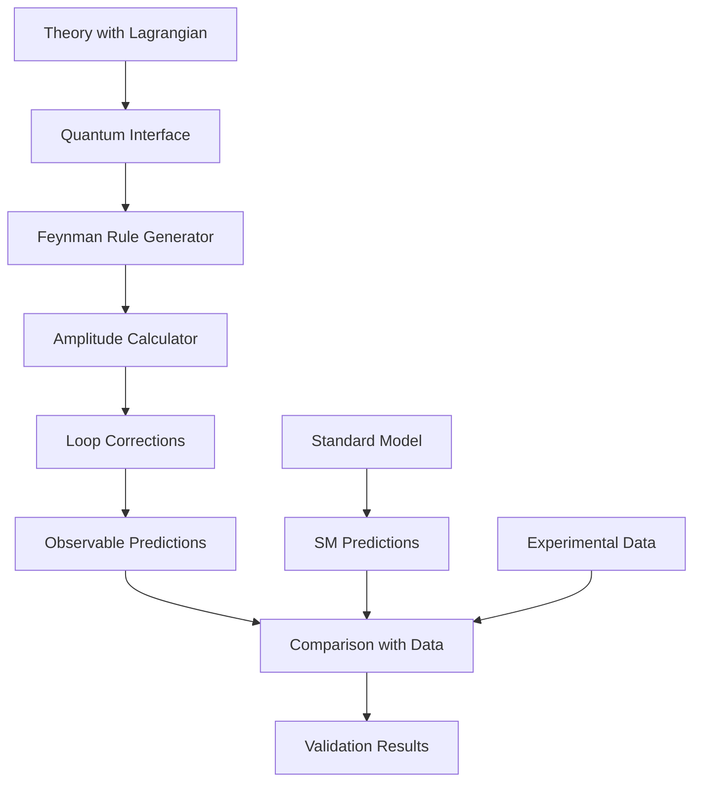

# Quantum Scale Tests Architecture Summary

## Core Concept
Instead of testing gravitational trajectories (which are insensitive to quantum effects at macroscopic scales), we test quantum observables where gravitational theories make distinct predictions through loop corrections and modified couplings.

## Architecture Flow



## Key Validators

### 1. Muon g-2 (Highest Priority)
- **Observable**: (g-2)/2 = 116592059(22) × 10^-11
- **SM Tension**: 4.2σ discrepancy
- **Theory Input**: Vertex corrections, new particles
- **Sensitivity**: 10^-11 level precision test

### 2. Scattering Amplitudes
- **Processes**: e⁺e⁻ → μ⁺μ⁻, Bhabha, Møller
- **Data**: LEP, SLAC, LHC precision measurements
- **Theory Input**: Modified propagators, new vertices
- **Sensitivity**: 0.1% level tests

### 3. Running Couplings
- **Observable**: α(M_Z) = 1/127.952
- **Data**: Energy dependence from colliders
- **Theory Input**: Beta functions, threshold corrections
- **Sensitivity**: Tests RG flow modifications

### 4. Anomaly Cancellation
- **Test**: Gauge consistency
- **Theory Input**: Particle content, charges
- **Validation**: Pass/fail consistency check

## Implementation Phases

### Phase 1: Basic Infrastructure (Weeks 1-3)
```python
# Core modules
quantum_amplitude_calculator.py  # Compute tree & loop amplitudes
standard_model_baseline.py      # SM predictions for comparison
feynman_diagram_engine.py       # Symbolic diagram computation
```

### Phase 2: g-2 Validator (Weeks 4-5)
```python
# Priority implementation
g_minus_2_validator.py          # Full g-2 calculation
├── One-loop QED corrections
├── Theory-specific vertices
├── New particle contributions
└── Comparison with Fermilab data
```

### Phase 3: Scattering Validators (Weeks 6-8)
```python
# Collider physics tests
scattering_amplitude_validator.py
├── 2→2 process library
├── Cross-section calculations
├── Angular distributions
└── Energy dependence
```

### Phase 4: Advanced Validators (Weeks 9-12)
```python
# Theoretical consistency
anomaly_cancellation_validator.py
beta_function_validator.py
vacuum_stability_validator.py
rare_decay_validator.py
```

## Data Flow Example: g-2 Calculation

```python
# 1. Theory provides quantum interface
theory = QuantumGravityTheory()
lagrangian = theory.get_lagrangian_density()
vertices = theory.get_interaction_vertices()

# 2. Extract couplings at muon mass scale
energy = 0.105658  # GeV (muon mass)
couplings = theory.get_coupling_constants(energy)

# 3. Calculate corrections
vertex_correction = theory.calculate_vertex_correction('muon', energy)
vacuum_pol = calculate_vacuum_polarization(theory, 'muon')
light_by_light = calculate_light_by_light_scattering(theory)

# 4. Total prediction
a_mu_theory = a_mu_SM + vertex_correction + vacuum_pol + light_by_light

# 5. Compare with experiment
chi2 = (a_mu_theory - a_mu_exp)**2 / sigma**2
```

## Key Advantages

1. **Precision**: Tests at 10^-11 level (g-2) vs 10^-3 for trajectories
2. **Quantum Sensitivity**: Directly probes quantum corrections
3. **Model Independence**: Uses actual experimental data, not baseline theories
4. **Clear Anomalies**: Several 3-5σ tensions to test against
5. **SLAC Relevance**: Directly applicable to collider physics

## Success Criteria

- **g-2**: Detect the 4.2σ muon anomaly
- **Scattering**: Match LEP precision (0.1%)
- **Consistency**: All theories pass anomaly cancellation
- **Performance**: Complete validation in < 10s per theory
- **Coverage**: Test both tree-level and loop corrections

## Integration with Existing System

```python
class GravitationalTheory:
    # Existing gravitational methods...
    
    # New quantum interface
    def get_lagrangian_density(self) -> SymbolicExpression
    def get_interaction_vertices(self) -> List[Vertex]  
    def get_coupling_constants(self, energy: float) -> Dict[str, complex]
    def calculate_vertex_correction(self, particle: str, energy: float) -> float
    def get_particle_spectrum(self) -> List[Particle]
```

## Next Implementation Steps

1. Create `quantum_amplitude_calculator.py` with basic QED
2. Implement `g_minus_2_validator.py` with muon focus
3. Add quantum interface to one test theory
4. Validate against known QED results
5. Extend to modified gravity theories